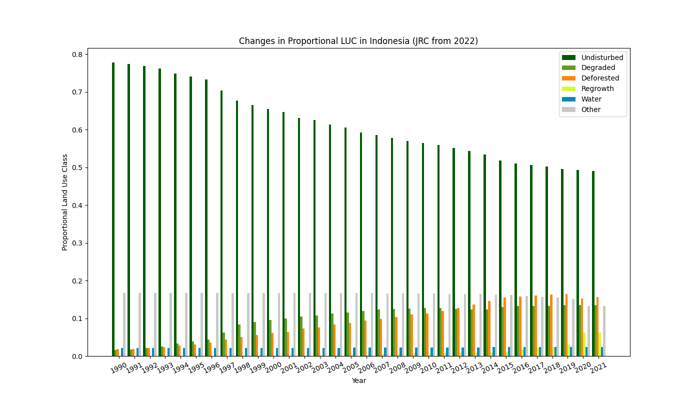

JRC Analysis
------------

Two scripts for analysing historic JRC TMF data. [src/gee.js](./src/gee.js)
contains code that can be loaded into Google Earth Engine to generate land use
class counts for different versions of the JRC dataset.
[src/main.py](./src/main.py) can then read those CSV files that are generated
and produce some graphs and statistics.

The [luc_data](./luc_data/) directory contains the output of running the
`gee.js` script for Indonesia and Malaysia. The differences as a percentage
change between 2021 and 2022 for Indonesia [can be found here](./output/Indonesia-prop-diff.csv).

